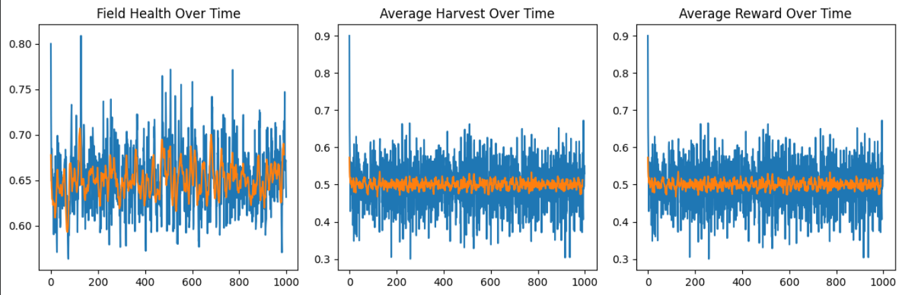
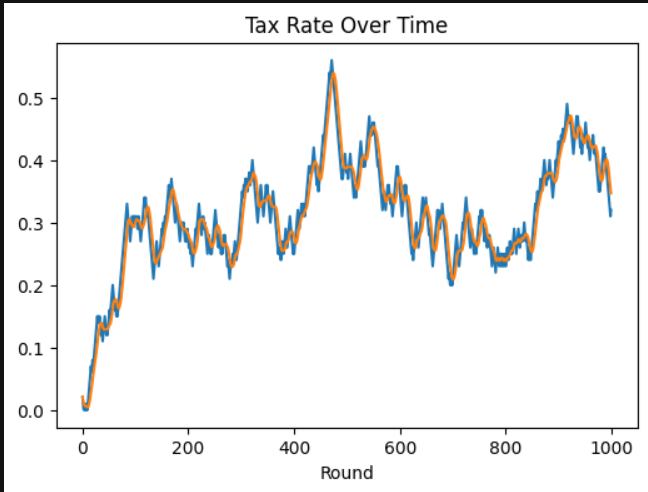
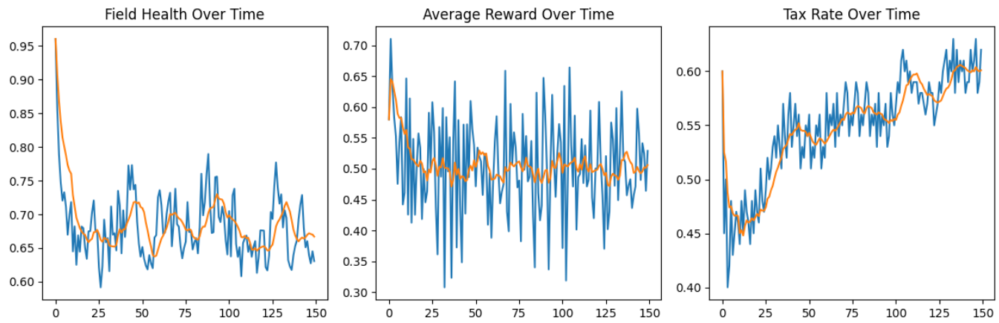
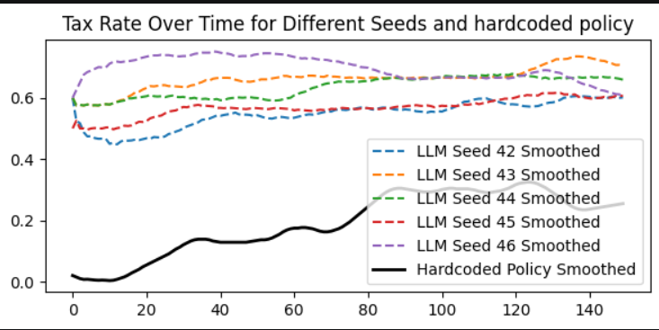
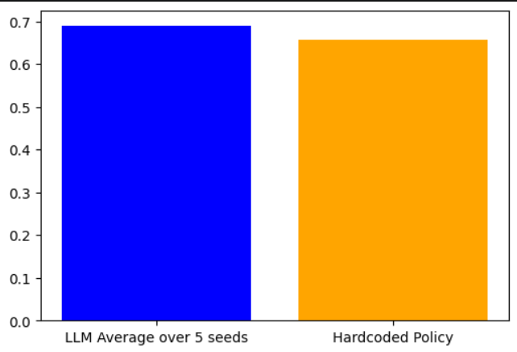

# AI Policy Maker

### The Environment
I built a simulation of a shared resource (an apple field) with multiple agents who decide how aggressively to harvest each round. Each agent chooses between a low (sustainable) and high (aggressive) harvest level based on the expected reward after tax and redistribution, a simplified version of apple example As shown in [Zhang et al., 2024](https://arxiv.org/abs/2402.14090).

The key idea is to model a social dilemma: harvesting more gives higher short-term reward, but if everyone does it, the field degrades and future rewards decrease. To control this, a policymaker sets a tax rate on production, and the collected tax is redistributed equally among agents.

### Initial hiccups
Initially, the system was too stable, agents did not overexploit the field, so the policymaker had little effect. After increasing the contrast between low and high actions and strengthening the field dynamics, the system began to show meaningful behavior. Agents responded to incentives, and the field could both degrade and recover.

### Hardcoded easily interpretable policy maker
A simple rule-based policymaker was used: if field health drops below a threshold(0.65 choosen experimentally), increase tax; otherwise decrease it. With proper tuning, this created a feedback loop where tax influenced agent behavior, which in turn affected the field. Over time, the system reached a stable equilibrium where:

* field health remained moderate (not collapsing or perfect),
* agents continued harvesting (non-zero rewards),
* tax adjusted dynamically to maintain balance.

This demonstrates the central idea of the paper[1](https://arxiv.org/abs/2402.14090): instead of directly controlling agents, we design incentives so that selfish behavior leads to socially desirable outcomes.

### LLM Policy maker
#### llama3-8b-instruct
The llama3-8b-instruct model behaves more smoothly and adaptively than the hardcoded policy. Instead of our previous hardcoded thresold policy it adapts to the situation and react and adjust, making to more suitable supposedly as a policy maker that justifies the claim by Gastowtt et all[2](https://arxiv.org/abs/2410.08345)

The below figure shows its performance overtime

>> api cost for each seed simulation is `$0.0142`[3]

### Result Comparision
#### Tax rate overtime 

>> REMARK: tax rate in LLM policy maker is significantly higher than that of hardcoded one
#### field health comparision

>> REMARK: average health over 50 rounds averaged over seeds is 0.69 and 0.66 for  hardcoded policy

References:
1. Position: Social Environment Design Should be Further Developed for AI-based Policy-Making [Zhang et al., 2024](https://arxiv.org/abs/2402.14090)

2. LARGE LEGISLATIVE MODELS: TOWARDS EFFICIENT AI POLICYMAKING IN ECONOMIC SIMULATIONS [Gasztowtt et al., 2024](https://arxiv.org/abs/2410.08345)

3. API cost documentation [NVIDIA API](https://build.nvidia.com/meta/llama-3_1-8b-instruct/deploy)